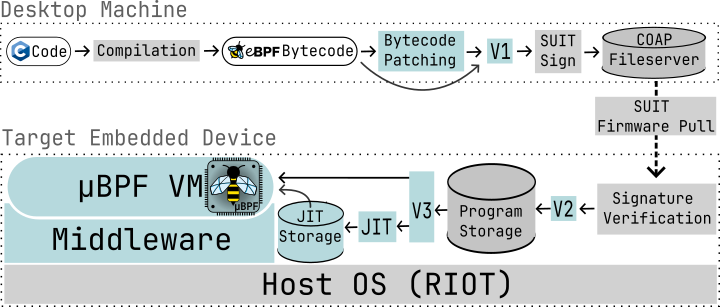
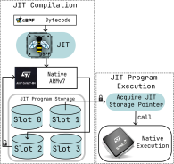

# µBPF

<picture>
  
</picture>

Using eBPF for microcontroller compartmentalization.

* [Description](#description)
* [Project directory structure](#project-directory-structure)
* [System architecture and programming model](#system-architecture-and-programming-model)
* [Deployment workflow](#deployment-workflow)
* [Getting started](#getting-started)
*  [Detailed overview](#detailed-overview)

## Description

This repository contains an end-to-end system for deploying and executing
eBPF programs on embedded devices.

`micro-bpf` consists of an eBPF virtual machine (VM), a just-in-time (JIT)
compiler targeting the ARMv7-eM architecture, server infrastructure compatible
with RIOT and a set of tools allowing to send eBPF program logic to
microcontroller devices and execute it there.

eBPF (extended Berkeley Packet Filter) is an instruction set architecture (ISA)
used in the Linux kernel to allow for executing custom user-defined code inside
of the kernel in a safe way. Although originally eBPF was intended to run in the
kernel, it can be used as a general-purposed fault isolation technology.

Because of its simplicity and support for program verification, eBPF can be
used in the context of embedded devices to provide a container-like environment
for sandboxed execution similar to docker.

The general idea is to compile programs written in a constrained subset of C
(or any other compatible front end) into eBPF bytecode and then send the
bytecode instructions to the target embedded device where they can later be
executed in an isolated VM envrionment. This allows for isolating the
underlying system from the code running in the VM. Additionally, being able to
load arbitrary programs means that the business logic deployed on the target
devices can be updated over-the-air without the need to reboot/reflash the
microcontroller.

## Project directory structure

`micro-bpf` repository consists of four main components:

- `RIOT` - a fork of RIOT - a popular operating system used in IoT applications
   it is used as the host OS on top of which runs the server infrastructure responsible
   for loading, managing and executing programs.
- `micro-bpf-server` - the server infrastructure that needs to be flashed onto the
   target devices, it contains a CoAP server used to communicate with the device
   and modules responsible for loading, verifying and executing eBPF code.
- `tools` - a suite of tools allowing to compile, verify, cryptographically
   sign and send eBPF programs to the deployed devices. It also provides a CLI
   tool to control program deployment and request execution.
- `vm` - the implementation of the eBPF VM used by `micro-bpf`, it contains a
   fork of [`rbpf`](https://github.com/qmonnet/rbpf) and an implementation
   of an eBPF-to-ARMv7 JIT compiler.

This repository also contains a set of example eBPF programs and applications
built on top of `micro-bpf`. Those are located under `examples`. Additionally,
a set of convenience scripts is provided in `scripts`.

## System architecture and programming model

### Deployment model

µBPF divides the process of deploying eBPF programs into two steps: deployment
stage and execution stage. The first stage involves compiling, verifying and
loading the program into memory of the target device. After that, in the
execution stage, clients can send requests to run previously-deployed programs.

To learn how to send a deployment and execution request to the target device,
refer to the README of the [`tools`](https://github.com/SzymonKubica/micro-bpf-tools) submodule.

The deployment pipeline used by µBPF can be seen below.

<picture>
  
</picture>

The deployment pipeline of µBPF consists of four steps: compila- tion, signing,
firmware upload, and verification. Figure above shows the pipeline. Grey boxes
represent existing infrastructure, whereas the contribution of µBPF is marked
in blue.

### Start of the pipeline

At the start of the the pipeline, source files in C are compiled into eBPF
bytecode. After that follows an optional bytecode patching step required for
backwards compatibility with Femto-Containers. µBPF supports 4 different eBPF
binary formats so this step can be skipped and a raw object file can
be fed into the next step of the pipeline.

### SUIT firmware update

Next step involves sending the program binary to the target device using the
SUIT update workflow provided by RIOT. First, the produced binaries are signed
with encryption keys matching the ones stored in the OS image running on the
target device. Then, a manifest file is created and signed. It is then stored
together with the program binary in the root directory of the CoAP fileserver.
The manifest provides information required by the target device to verify that
the loaded program has not been tampered with and originates from a trusted
source. The device then fetches the compiled eBPF bytecode and its manifest
file from the CoAP fileserver, verifies the signature and loads the program
into one of the RAM storage slots provided by the RIOT’s SUIT subsystem.

### Execution stage

After the deployment stage is complete, clients can begin sending requests to
start executing the loaded programs. Clients can choose between executing the
program using the VM interpreter or using the JIT compiler and then executing
the emitted native code. After a given program is JIT-compiled, its bytecode is
stored in an additional JIT program storage (see Figure 1). Upon receiving a
request to rerun the program, the compilation process can be skipped. Here we
note that when using the JIT compiler additional memory is required as the
eBPF bytecode needs to be translated into the native instructions and written
into a new memory buffer. However, after this is done, the original eBPF
program can be discarded allowing to save memory

<picture>
  
</picture>

Figure above illustrates how the µBPF JIT compiler gets access to one of the
program buffers in the JIT program storage, translates the source eBPF program
into native machine code instructions and writes them into the buffer. After
that, the program is stored in the JIT-compiled program storage. It can then be
retrieved and executed multiple times allowing to amortise the cost of JIT
compilation.

## Getting started

## Detailed overview

A thorough documentation of the implementation process and an evaluation of
the system performance can be found in my Master's thesis [here](examples/docs/paper.pdf)
