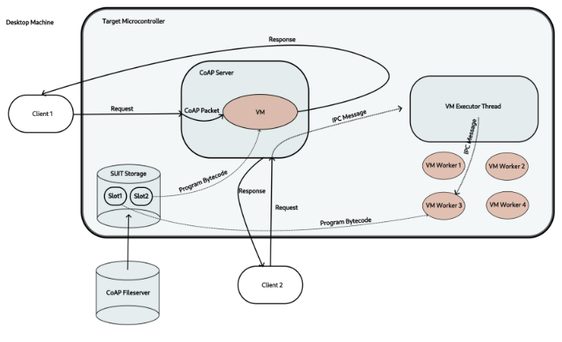

# Restricting VM access to helper function calls

Existing implementations of eBPF VM don't restrict access to helper function
calls on a per-VM-instance basis. It introduces security issues as outlined below.

Possible ways of implementing the access restrictions:

1. Configure helpers when sending a request to initiate
   a VM execution (once per VM invocation).
2. Add helpers metadata to the program binary (once per binary compilation).
3. Configure accessible helpers when spawning a VM worker thread (it is done once at the start and
   cannot be modified even if the program to execute by the worker gets changed)

### 1. Specifying helpers with the execution requests

This is the simplest approach and has already been implemented. It involves
specifying a list of helper funtion IDs that should be made accessible to the
VM that will be executed immediately after this request is received.

One limitation of this method is that we need to propagate the list of allowed
helpers from the request to the VM executor via the RIOT IPC message passing.
This is a bit problematic as the maximum message size is 32 bits. The current
implementation uses 8 bits to specify the VM configuration (target version of
the VM, program binary location, and binary layout) and the remaining 24 bits are
used as a bit string that specifies whether each of the 24 available helper functions
can be used by the VM like so:

```rust
#[repr(C, packed)]
pub struct VMExecutionRequestMsg {
    pub configuration: u8,
    pub available_helpers: [u8; 3],
}

```
The problem is that we can only control access to at most 24 helper functions.
One idea could be to use one additional bit in the configuration field to specify
which set of helpers should be made accessible, in which case we could have two
sets of 24 helpers to choose from.

The current implementation modifies the rbpf verifier to check if only the allowed
helpers are called, otherwise it doesn't start executing the VM and fails gracefully
without panicking.

### 2. Adding helper function metadata to the program binary

This approach would require modifying the bytecode patching script to include
the list of allowed helper indices in the metadata header section of the program
binary. It isn't expensive to implement, however it doesn't allow for changing
allowed helpers on the fly (do we want that?).

### 3. Configuring helpers that can be accessed by every VM worker.

This approach aims to configure the accessible helper on a per-VM-worker basis.
It is important to note that because of the multithreading setup with rust in
RIOT, the number of VM workers is constant and they are all spawned at the
start of the application (and they continue running until the whole OS is terminated,
unless the code panics). The reason for it is that the `threadscope` used for
spawning threads doesn't allow for spawning threads on the fly and then continuing
with the control flow of the program (because of the lifetime rules).
Because of this limitation, the VM workers are spawned at the beginnig and then
they wait until the vm execution manager thread will send them a message to
start executing a given instance of the VM.

Given this architecture, we could specify the list of helpers that should be
accessible for all VM instances running on a particular worker and then
possibly allow for overriding that later on (by means of message passing IPC).



## Motivation for controlling access to helper calls

An important limitation of the existing eBPF VM implementations for IOT devices
is that all loaded programs have access to the same fixed set of helper functions
that they can call to interact with the underlying embedded OS. The problem with
this approach is that two instances of the VM executing concurrently could interfere
with each other by making calls that change the global state of the OS.

For example, the FemtoContainers implementation doesn't implement mechanisms to
restrict that access because they don't provide helpers that allow for direct
writing into the peripherals connected to the device (e.g. `saul_reg_write`).
However, that implementation allows programs for reading from and writing to the
global storage (an equivalent of BPF maps) and so programs that misbehave could
corrupt state stored there by other instances of the VM.

Consider another example: if we allowed the VMs to control peripherals
connected to the microcontrollers by directly reading from and writing to the
device's GPIO, we could run into issues where a misbehaving instance of the VM
can corrupt the state of another one.

Imagine the first instance of the VM running on thread A is using the digital
pin D9 for getting the temperature and humidity measurements from the DHT
sensor connected to it. This process requires read and write access to pin D9
and depends on strict time requirements (e.g. D9 needs to be set to HIGH for
precisely 1ms to initiate communication with the DHT sensor (see
[here](https://www.sparkfun.com/datasheets/Sensors/Temperature/DHT22.pdf)))

If at the same time some other instance on thread B tries to control D9 thinking
that it is responsible for controlling some status LEDs on the device, it would
interfere with the temperature measurement and corrupt the data collected by
the first instance.

1.

- When sending a request specify the list of IDs of helpers that should be allowed
- Have the verifier check if only valid calls are made
- How do we authenticate in this case?

2. When building the binary append the list of allowed helpers at the top of
the file (and modify the header structure to allow for that). Then have the
verifier read that information and perform verification

