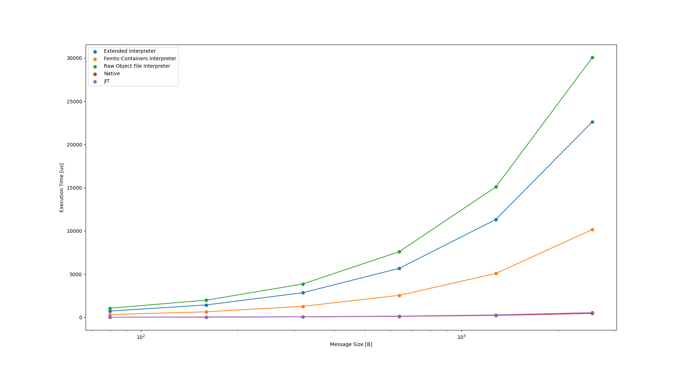

# Performance discrepancy between `rbpf` and Femto-Containers VM

After preliminary bencharks, it turned out that the eBPF VM implementation
proposed by Femto-Containers is roughly twice as fast as the Rust-based `rbpf`
VM and its derivatives. This document is a case study of that performance discrepancy
and aims to find the root cause of that difference and possibly modify the
`rbpf`-based VMs to make their performance in line with the previous contribution
proposed by Femto-Containers.

The results of initial benchmarks can be seen below:


The tested workflow involved calculating a [Fletcher16](https://en.wikipedia.org/wiki/Fletcher%27s_checksum)
checksum for an input string of increasing length. The initial length of the
input string was 80B and then it was being increased by a factor of 2 all the
way up to 2560B.

The orange line represents performance of the Femto-Containers VM whereas the
blue and green one correspond to the two extensions of the rbpf VM interpreter
that I implemented. One may notice that the performance discrepancy is quite
sizeable, it seems like the `rbpf`-based interpreters are more than twice slower
than the Femto-Containers implementation. What is more, the overhead seems
to increase proportionally to the input size, which indicates that the performance
penalty is incurred during the program execution and shouldn't be attributed to
some initialisation overhead before the VM starts executing the program.

The two possible explanations of this discrepancy that I was thinking about
are the following:

- **Memory access overhead** - both versions of the VM perform safety check on
  each load/store instrucion to ensure that memory accesses are only touching
  allowed regions. Given that our benchmark iterates over characters in an input
  string, all of which are stored in the `.rodata` (read-only data) section of the
  loaded program, it is the case that the longer the input, the more memory accesses
  need to be executed by the VM. Therefore, a performance discrepancy in that place
  could lead to the results that we were seeing in the initial benchmarks.

- **Instruction interpretation overhead** - the two competing implementations
  of the VM use slightly diffferent internal representation of the eBPF instructions.
  In case of Femto-Containers, this is the struct that represents a single eBPF instruction:
  ```C
  typedef struct __attribute__((packed)) {
    uint8_t opcode;
    unsigned dst:4;
    unsigned src:4;
    int16_t offset;
    int32_t immediate;
  } bpf_instruction_t;
  ```
  Whereas in case of `rbpf`, each instruction is modelled by this struct:
  ```rust
  pub struct Insn {
    /// Operation code.
    pub opc: u8,
    /// Destination register operand.
    pub dst: u8,
    /// Source register operand.
    pub src: u8,
    /// Offset operand.
    pub off: i16,
    /// Immediate value operand.
    pub imm: i32,
  }
  ```
  In the actual body of the interpreter, for each instruction executed by FC-VM,
  it simply casts a given pointer into the `.text` section of the eBPF program
  into a pointer to the instrution struct like so:
  ```c
  const bpf_instruction_t *instr = (const bpf_instruction_t*)f12r_text(femtoc);

  ```
  By contrast, every time `rbpf` processes an instruction, it constructs the
  internal representation struct using the following function:
  ```rust
  pub fn get_insn(prog: &[u8], idx: usize) -> Insn {
    // This guard should not be needed in most cases, since the verifier already checks the program
    // size, and indexes should be fine in the interpreter/JIT. But this function is publicly
    // available and user can call it with any `idx`, so we have to check anyway.
    if (idx + 1) * INSN_SIZE > prog.len() {
        panic!(
            "Error: cannot reach instruction at index {:?} in program containing {:?} bytes",
            idx,
            prog.len()
        );
    }
    Insn {
        opc: prog[INSN_SIZE * idx],
        dst: prog[INSN_SIZE * idx + 1] & 0x0f,
        src: (prog[INSN_SIZE * idx + 1] & 0xf0) >> 4,
        off: LittleEndian::read_i16(&prog[(INSN_SIZE * idx + 2)..]),
        imm: LittleEndian::read_i32(&prog[(INSN_SIZE * idx + 4)..]),
    }
  }
  ```
  This could be problematic as it means that every time the VM wants to process
  an instruction, this logic needs to run, whereas in case of FC-VM we just
  shift the instruction pointer to the next place in the `.text` section of the program.

### Investigating causes of the performance overhead

1. Memory access checks.

In order to determine if the memory accesses verification performed by `rbpf` was
causing the execution overhead, I have simply disabled those checks and then compared
performance of the two versions of the VM. The results were the following:


The benchmark was run using the `native` version of the RIOT OS, i.e. the operating
system was running natively on my machine emulating a 32 bit OS and my testing
framework was communicating with it over the `tap` network interface.

The benchark setting was as before timing the execution of the Fletcher16
checksumming algorithm for input strings of increasing length. We can observe
that the performance overhead is still there, which leads us to suspect that
the instruction interpretation overhead (outlined above) could be the root
cause of the performance discrepancy.

2. Instruction interpreting overhead.

